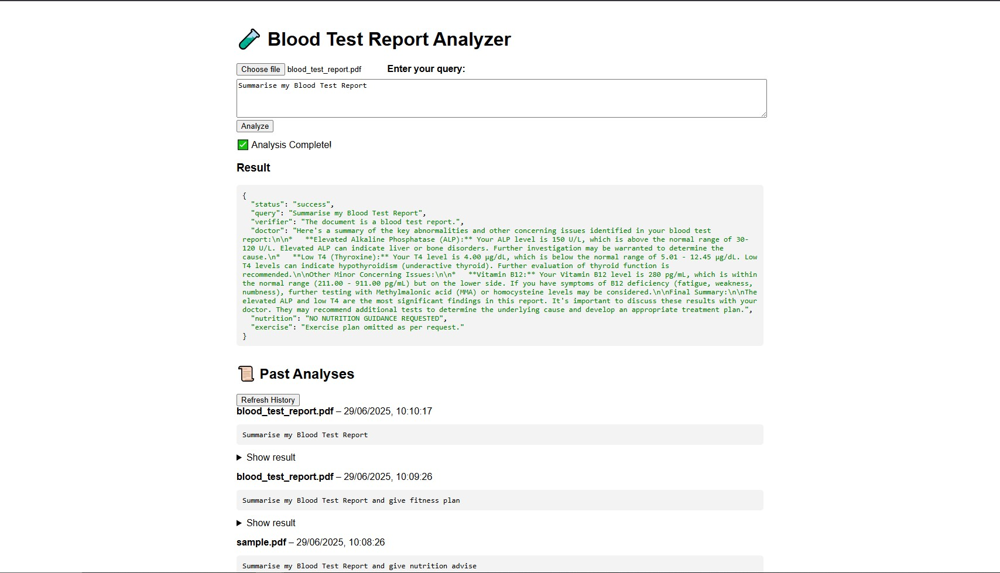

# 🧪 Blood Test Analyzer (CrewAI Prototype)

This project is a **barebones prototype** built with [CrewAI](https://github.com/joaomdmoura/crewai), FastAPI, and Redis to demonstrate how autonomous agents can collaboratively analyze blood test reports. Multiple agents (Verifier, Doctor, Nutritionist, and Exercise Expert) work in sequence to extract key findings, provide diet/fitness suggestions, and respond based on user queries.



## 🛠️ Setup Instructions
Follow these steps to run the Blood Test Analyzer — works locally via FastAPI and Redis Queue.

### ✅ 1. Clone the Repository

```bash
https://github.com/S-panda1/Blood-test-analysis-system-Subhankar-Panda.git
cd Blood-test-analysis-system-Subhankar-Panda
```

### ✅ 2. Create and Activate a Virtual Environment

```bash
# Create virtual environment
python -m venv venv

# Activate it
# For Windows:
venv\Scripts\activate

# For MacOS/Linux:
source venv/bin/activate
```
### 3. Install Dependencies

```bash
pip install --upgrade pip

pip install -r requirements.txt

```
### 4. Set Up .env File

```bash
GEMINI_API_KEY="YOUR_API_KEY_HERE"
REDIS_URL="YOUR_REDIS_URL_HERE"
```
[Gemini API Docs](https://ai.google.dev/)
[Redis](https://redis.io/)
###  5. Start Redis Queue Worker

```bash
python worker.py

```
### ✅ 6. Run the Server (FastAPI + Uvicorn)

```bash
uvicorn main:app --reload

http://127.0.0.1:8000 # The server will start here

```
## 🐞 Bugs Found and Improvements Made
**(Database Integration + Queue Worker Model)**

### 🔧 Bugs Fixed & Features Added

---

### 🗂 `tools.py`
- ✅ **Proper CrewAI Tool Implementation**  
  Refactored all custom tools (`BloodTestReportTool`, `NutritionTool`, `ExerciseTool`) to subclass `BaseTool` using `_run()` method.
- ✅ **PDF Parsing Fixed**  
  Added missing import: `PyPDFLoader` from `langchain_community.document_loaders`.
- ✅ **Dynamic File Handling**  
  Tools now take dynamic `file_path` inputs instead of hardcoded values.
- ✅ **LLM-Backed Logic**  
  Nutrition and exercise tools now generate intelligent plans using `LLM(model="gemini/gemini-2.0-flash")`.

---

### 👨‍⚕️ `agents.py`
- ✅ **Realistic Agent Design**  
  Replaced harmful placeholders with well-prompted agents:
  - `doctor`
  - `nutritionist`
  - `exercise_specialist`
  - `verifier`
- ✅ **Proper Tool Integration**  
  Tools passed as instantiated objects instead of broken method calls.
- ✅ **LLM Setup Standardized**  
  All agents use `crewai.LLM()` for consistent, high-quality reasoning.

---

### 🚀 `main.py`
- ✅ **4-Agent Crew Setup**  
  Crew includes: `verifier`, `doctor`, `nutritionist`, `exercise_specialist`.
- ✅ **Safe Output Handling**  
  Introduced `safe_output()` to gracefully handle failures.
- ✅ **File Validation Added**  
  Now checks for:
  - Empty uploads
  - Missing query inputs
- ✅ **SQLite Integration**  
  Stores reports, queries, and results using SQLAlchemy ORM.
- ✅ **Static File Mounting**  
  `/static` mounted for frontend integration.

---

### 📊 `task.py`
- ✅ **Prompt Fixes & Clarity**  
  Rewrote ambiguous prompts for structured, professional medical outputs.
- ✅ **Correct Imports**  
  Now correctly imports `nutritionist`, `exercise_specialist` agents and their tools.

---

## 🧩 Extra Files Added

---

### 🧠 `tasks.py`
Defines all CrewAI Task objects such as:
- Report verification  
- Medical analysis  
- Nutrition planning  
- Exercise suggestions  
Tasks use proper agent context and tools, executed sequentially.

---

### 🗃 `db.py`
- Sets up a local **SQLite DB** using **SQLAlchemy**.
- Stores:
  - Uploaded file metadata
  - User queries
  - Generated outputs

---

### 🔁 `redis_connect.py`
- Establishes a shared **Redis** connection.
- Uses `REDIS_URL` from `.env`.
- Shared across async worker modules.

---

### ⚙️ `worker.py`
- Runs an **RQ (Redis Queue)** worker.
- Use in a separate terminal for **asynchronous background execution**.

## API Documentation

This project exposes a REST API using **FastAPI** to analyze blood test reports using multi-agent AI with CrewAI.

### 🔗 Base URL
```bash
http://localhost:8000

```
### 📍 POST /analyze
#### Description:
Upload a blood test PDF report and provide a query. The system will analyze the report and return structured insights.

#### Request:
Content-Type: multipart/form-data

#### Fields:

- file: Blood test report in PDF format (Required)

- query: A string describing what you want (Optional, defaults to "Summarise my Blood Test Report")
  
```bash
curl -X POST http://localhost:8000/analyze \
  -F "file=@blood_test_report.pdf" \
  -F "query=Summarize key findings and suggest a diet plan"
```
#### Results: 
```bash
{
  "status": "success",
  "query": "Summarize key findings and suggest a diet plan",
  "analysis": {
    "verifier": "The document is a blood test report.",
    "doctor": "... summarized findings ...",
    "nutrition": "... diet recommendations ...",
    "exercise": "... fitness recommendations ..."
  },
  "file_processed": "blood_test_report.pdf"
}
```

#### You can also test this endpoint interactively via:
```bash
http://localhost:8000/docs#/
```

### 📍 GET /history
#### Description:
Returns a list of all previous analyses stored in the database.

```bash
[
  {
    "id": 1,
    "file_name": "blood_test_report.pdf",
    "query": "Summarize my Blood Test Report",
    "created_at": "2025-06-29T15:21:30.174Z",
    "result": "{...}"
  },
  ...
]

```
### Using the HTML file
#### Location:
Open this file in your browser:
```bash
Open the HTML demo:
http://localhost:8000/static/index.html
```

#### Features:
- Upload your blood test PDF

- Type a custom query like:

 ```bash

"Summarise my blood report"

"Focus only on thyroid"

"Skip everything" (To return nothing)

```
#### Output:
You’ll see:
- A structured summary
- Nutrition & fitness suggestions (if query permits)
- JSON output displayed on screen


---
